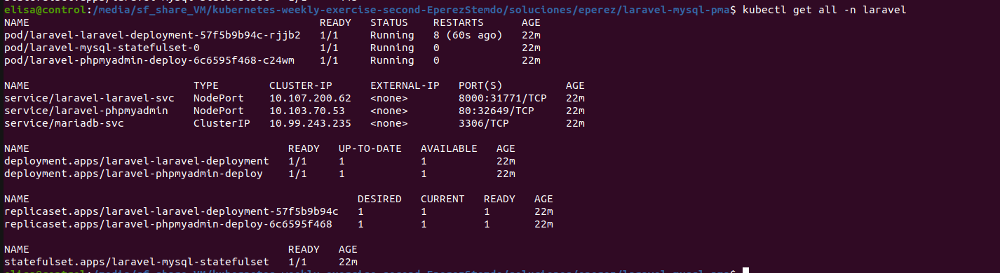
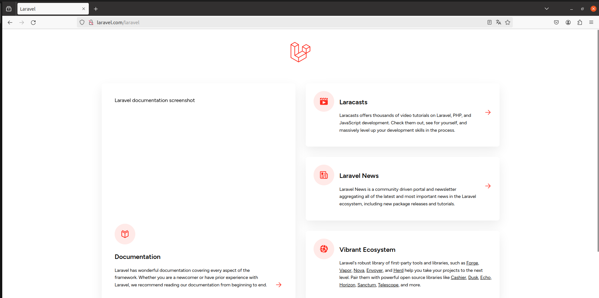

# Helm

Se ha creado un chart con:

- Laravel y MySQL
- phpmyadmin (opcional)

Para desplegarlos (estando dentro de la carpeta del chart) se utiliza el comando:

```
helm install <nombre_release> .
```
### Charts

Dentro del chart se encuentra la carpeta ``templates`` con los recursos que se van a crear al instalar el chart. También existe el archivo ``values.yaml``, en el cual están los valores que se pueden modificar según la necesidad.

La opción de desplegar phpmyadmin es opcional:

- Si se quiere desplegar
```
phpmyadmindeploy: true
```
- Si no se quiere desplegar
```
phpmyadmindeploy: false
```

### Comprobar que los recursos están funcionando

Una vez instalado el chart, se comprueba que los recursos estén funcionando correctamente. Para ello se introduce el comando:

```
kubectl getl all -n laravel
```



### Acceder al navegador 

Se accede al navegador para comprobar que laravel se ha desplegado correctamente. Para ello se introduce en el navegador:

```
laravel.com/laravel
```




